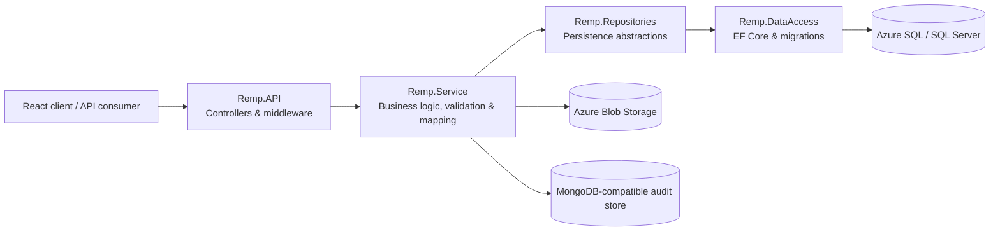

# Recam API

[](https://github.com/Citusco/Recam/actions/workflows/deploy.yml)
[](https://dotnet.microsoft.com/)
[](https://xunit.net/)
[](https://azure.microsoft.com/)

Recam is a cloud-hosted ASP.NET Core Web API for coordinating real-estate media production. It enables photography companies to create property listing cases, assign agents, upload media, manage case progression, and capture an agent's final media selection.

This repository demonstrates layered backend architecture, role-based authorization, relational and document persistence, Azure media storage, automated testing, and continuous deployment.

## Highlights

- Role-based workflows for photography company administrators and agents
- JWT authentication with ASP.NET Core Identity and secure cookie support
- Listing case lifecycle: `Created -> Pending -> InReview -> Delivered`
- Image and video storage through Azure Blob Storage
- SQL Server persistence with Entity Framework Core migrations
- MongoDB-compatible audit history for authentication and case activity
- FluentValidation request validation and RFC 7807-style error responses
- Unit tests with xUnit, Moq, and EF Core InMemory
- GitHub Actions pipeline for restore, build, test, publish, and Azure deployment

## Architecture



### Solution structure

| Project | Responsibility |
| --- | --- |
| `Remp.API` | HTTP endpoints, authentication, authorization, CORS, middleware, dependency injection |
| `Remp.Service` | Application services, DTOs, validation, AutoMapper profiles, blob and audit integrations |
| `Remp.Repositories` | Repository interfaces and EF Core persistence operations |
| `Remp.DataAccess` | `DbContext`, entity configuration, migrations, and database seeding |
| `Remp.Models` | Domain entities and enums |
| `Remp.Tests` | Service and repository unit tests |

## Core workflows

### Administrator

1. Registers a photography company administrator account.
2. Adds agents to the photography company.
3. Creates and updates listing cases.
4. Assigns an agent to a listing case.
5. Uploads property images or video.
6. Advances the listing through its delivery lifecycle.

### Agent

1. Signs in and views assigned listing cases.
2. Reviews available media for a listing.
3. Selects up to ten final media assets.
4. Retrieves the final selection for delivery.

## API overview

| Area | Representative endpoints | Access |
| --- | --- | --- |
| Authentication | `POST /api/auth/register`, `POST /api/auth/login`, `GET /api/auth/me`, `POST /api/auth/logout` | Public / authenticated |
| Listing cases | `POST /api/listingcase`, `GET /api/listingcase`, `PUT /api/listingcase/{id}`, `PATCH /api/listingcase/{id}/status` | Admin / authenticated |
| Assignment | `POST /api/listingcase/{id}/agent/{agentId}` | Admin |
| Media | `POST /api/listings/{id}/media`, `GET /api/listings/{id}/media`, `DELETE /api/media/{id}` | Admin / authenticated |
| Final selection | `PUT /api/listings/{id}/selected-media`, `GET /api/listings/{id}/final-selection` | Agent |
| Company agents | `POST /api/photographycompany/agents/{agentId}`, `GET /api/photographycompany/agents` | Admin |

In Development, OpenAPI metadata and Scalar API reference are enabled. After starting the API, open `https://localhost:7106/scalar/v1`.

## Technology stack

- **Runtime:** .NET 10, ASP.NET Core Web API
- **Data:** Entity Framework Core, SQL Server / Azure SQL
- **Identity:** ASP.NET Core Identity, JWT bearer authentication, role-based authorization
- **Document storage:** MongoDB Driver with a MongoDB-compatible Azure service
- **Media storage:** Azure Blob Storage
- **Validation and mapping:** FluentValidation, AutoMapper
- **API documentation:** OpenAPI, Scalar
- **Testing:** xUnit, Moq, EF Core InMemory, Coverlet
- **Delivery:** GitHub Actions, Azure App Service

## Getting started

### Prerequisites

- [.NET 10 SDK](https://dotnet.microsoft.com/download)
- SQL Server or an Azure SQL database
- MongoDB-compatible database
- Azure Storage account and blob container named `recam`

### 1. Clone and restore

```bash
git clone https://github.com/Citusco/Recam.git
cd Recam
dotnet restore
```

### 2. Configure secrets

The API reads secrets through the standard .NET configuration system. For local development, use User Secrets instead of committing credentials:

```bash
dotnet user-secrets set "ConnectionStrings:RecamDb" "<sql-connection-string>" --project Remp.API
dotnet user-secrets set "MongoDB:ConnectionString" "<mongodb-connection-string>" --project Remp.API
dotnet user-secrets set "MongoDB:DatabaseName" "RecamLogs" --project Remp.API
dotnet user-secrets set "Azure:BlobConnectionString" "<azure-storage-connection-string>" --project Remp.API
dotnet user-secrets set "Jwt:Key" "<strong-random-signing-key>" --project Remp.API
dotnet user-secrets set "Jwt:Issuer" "Remp-API" --project Remp.API
dotnet user-secrets set "Jwt:Audience" "Remp.Client" --project Remp.API
dotnet user-secrets set "AdminSeed:Email" "admin@example.com" --project Remp.API
dotnet user-secrets set "AdminSeed:Password" "<strong-admin-password>" --project Remp.API
dotnet user-secrets set "AdminSeed:CompanyName" "Recam" --project Remp.API
```

Configure allowed frontend origins in `Remp.API/appsettings.Development.json` or User Secrets:

```json
{
  "Cors": {
    "AllowedOrigins": ["http://localhost:5173"]
  }
}
```

### 3. Apply migrations

```bash
dotnet tool restore
dotnet ef database update --project Remp.DataAccess --startup-project Remp.API
```

### 4. Run the API

```bash
dotnet run --project Remp.API
```

Local endpoints:

- HTTPS: `https://localhost:7106`
- HTTP: `http://localhost:5223`
- Scalar API reference: `https://localhost:7106/scalar/v1`

## Testing

The test suite currently contains **36 passing tests** covering listing case and media service behavior as well as repository persistence and soft-delete rules.

```bash
dotnet test
```

Run a focused test class:

```bash
dotnet test --filter "FullyQualifiedName~MediaAssetServiceTests"
```

Current test areas include:

- Listing case creation, retrieval, status transitions, access rules, and persistence
- Media upload rules, authorization, mapping, deletion, and retrieval
- Repository filtering, ownership checks, soft deletion, and existence queries

## CI/CD

`.github/workflows/deploy.yml` runs whenever code is pushed or merged into `main`, and can also be started manually.

```text
Checkout -> Restore -> Build -> Test -> Publish -> Deploy to Azure App Service
```

Deployment authentication is stored in the GitHub Actions secret `AZURE_WEBAPP_PUBLISH_PROFILE`. Runtime connection strings and credentials are configured in Azure App Service settings and are not stored in source control.

## Engineering decisions

- **Layered solution:** separates HTTP, application, persistence, and domain responsibilities.
- **Repository abstractions:** keep business services testable without a live relational database.
- **Soft deletion:** preserves listing and media history while hiding deleted records from active queries.
- **Dedicated audit store:** keeps authentication and case-history records separate from transactional SQL data.
- **Fail-fast CI:** deployment is blocked when restore, build, or tests fail.
- **Environment-based configuration:** local and cloud credentials remain outside the repository.

## Roadmap

- Evaluate a gradual migration from the modular monolith to microservices, extracting bounded contexts only where independent scaling or deployment provides clear value
- Build a vendor-neutral OpenTelemetry pipeline for distributed traces, metrics, and logs, with export to Azure Monitor / Application Insights and optional AWS X-Ray integration
- Add API integration and end-to-end tests
- Introduce health checks for SQL, MongoDB, and Blob Storage
- Replace publish-profile deployment with Azure workload identity federation
- Add containerized local infrastructure for reproducible development

## Author

Built as a production-oriented portfolio project demonstrating backend engineering with ASP.NET Core and Azure.

---

If this project is useful, consider starring the repository.
